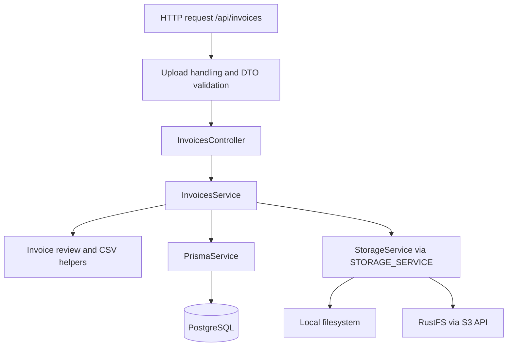

# Invoi Backend

NestJS backend for uploading, storing, reviewing, and managing invoice records.

**NestJS · TypeScript · Prisma · PostgreSQL · RustFS / S3-compatible storage**

## Overview

The backend accepts invoice files, persists invoice metadata and ownership, lists and filters records, supports manual corrections and deletion, exports CSV, and evaluates invoice review rules. It also exposes a basic health endpoint.

Authentication, authorization, OCR, and AI extraction are not implemented. Uploads require a client-supplied ID for an existing user; uploading a file creates a record with `processing` status without starting a processing job.

## Tech Stack

| Area | Technology |
| --- | --- |
| Runtime | Node.js 22 in the backend build and runtime images; npm with `package-lock.json` |
| Framework | NestJS 11 with the Express adapter |
| Language | TypeScript 5 with strict checking |
| Database | PostgreSQL; Compose uses PostgreSQL 16 |
| ORM | Prisma 6 |
| Storage | Local filesystem or RustFS through its S3-compatible API |
| S3 client | AWS SDK v3, `@aws-sdk/client-s3` |
| Request validation | `class-validator`, `class-transformer`, NestJS validation pipes |
| Upload handling | Multer with memory storage |
| Testing | Jest, ts-jest, NestJS testing utilities, Supertest |
| Static analysis | ESLint with TypeScript recommended rules |
| Containers / CI | Root Dockerfile, Docker Compose, Jenkins |

## Project Structure

```text
backend/
├── prisma/
│   ├── schema.prisma
│   └── migrations/
├── src/
│   ├── health/
│   ├── invoices/
│   │   ├── dto/
│   │   ├── invoice-csv.ts
│   │   ├── invoice-review.ts
│   │   ├── invoices.controller.ts
│   │   ├── invoices.module.ts
│   │   └── invoices.service.ts
│   ├── prisma/
│   ├── storage/
│   ├── app.module.ts
│   └── main.ts
├── test/
│   ├── fixtures/
│   ├── jest-e2e.json
│   └── *.e2e-spec.ts
├── nest-cli.json
├── package.json
└── tsconfig.json
```

| Location | Responsibility |
| --- | --- |
| [src/invoices/](src/invoices/) | HTTP endpoints, upload lifecycle, updates, review rules, CSV formatting |
| [src/invoices/dto/](src/invoices/dto/) | Allowed request fields and validation |
| [src/storage/](src/storage/) | Storage interface, driver selection, local and RustFS implementations, legacy reference routing |
| [src/prisma/](src/prisma/) | Shared Prisma client and connection lifecycle |
| [prisma/](prisma/) | Database schema and versioned SQL migrations |
| [src/health/](src/health/) | Basic application health response |
| [test/](test/) | API, service, review, storage, schema, and optional PostgreSQL tests |

## Architecture



[AppModule](src/app.module.ts) imports `PrismaModule`, `StorageModule`, `InvoicesModule`, and `HealthModule`. `PrismaModule` is global; its service connects on module initialization and disconnects on module destruction.

[main.ts](src/main.ts) sets the `/api` prefix and a global validation pipe that transforms DTOs and rejects unknown fields. When `frontend/dist/index.html` exists, the same process also serves the built frontend and its non-API GET fallback.

`InvoicesService` uses the `StorageService` interface through the `STORAGE_SERVICE` injection token. [StorageModule](src/storage/storage.module.ts) selects the provider at startup: local storage directly, or initialized RustFS storage wrapped in `ReferenceRoutingStorageService`. Unsupported drivers fail startup. Invoice business logic should remain independent of the AWS SDK and RustFS configuration.

## API

All routes use the **`/api`** prefix. A standalone server defaults to `http://localhost:3000/api`.

| Method | Path | Purpose |
| --- | --- | --- |
| GET | `/api/health` | Return `{ "status": "ok" }` |
| POST | `/api/invoices/upload` | Upload a file for an existing user; return `invoice_id` |
| GET | `/api/invoices` | List invoices with optional status and date filters |
| GET | `/api/invoices/export` | Export the filtered list as CSV |
| GET | `/api/invoices/:id` | Retrieve an invoice record |
| GET | `/api/invoices/:id/status` | Retrieve its stored status |
| PUT | `/api/invoices/:id` | Apply manual corrections and reevaluate review rules |
| DELETE | `/api/invoices/:id` | Delete the record and associated file; return HTTP 204 |

Uploads use multipart fields `file` and `userId`, accepting PDF, JPEG, and PNG. The configured size limit defaults to 10 MiB. Listing and export accept `status` and `date=YYYY-MM-DD`; date filtering uses `invoiceDate` within that UTC day. Results are ordered by `createdAt` descending.

Updates accept the editable business fields defined in [UpdateInvoiceDto](src/invoices/dto/update-invoice.dto.ts). Omitted fields are preserved, explicit `null` clears nullable fields, and at least one editable field is required. Ownership, file references, status, and extraction confidence are not client-editable through this DTO. Record responses retain `sellerName` and `amount` aliases for `vendorName` and `totalAmount`.

The team's detailed API contract is maintained separately in Notion. This section provides codebase orientation rather than the complete contract.

## Invoice Model

The source of truth is [prisma/schema.prisma](prisma/schema.prisma).

| Fields | Role |
| --- | --- |
| `id`, `userId`, `fileUrl`, `status` | Identity, required owner, storage reference, and stored lifecycle status |
| `vendorName`, `invoiceNumber`, `invoiceDate`, `dueDate` | Invoice details |
| `totalAmount`, `taxAmount`, `amountPaid` | Nullable `Decimal(12,2)` monetary values |
| `currency`, `paymentStatus`, `paymentMethod` | Nullable reporting enums |
| `customerName` | Document customer name; separate from account identity |
| `taxNumber`, `crNumber` | Vendor tax and commercial registration numbers |
| `extractionConfidence`, `needsReviewReason` | Nullable JSON confidence data and review reason string |
| `createdAt`, `updatedAt` | Creation and modification timestamps |

| Enum | Values |
| --- | --- |
| `InvoiceStatus` | `processing`, `completed`, `needs_review` |
| `PaymentStatus` | `paid`, `unpaid`, `partially_paid`, `overdue` |
| `PaymentMethod` | `bank_transfer`, `credit_card`, `cash`, `cheque`, `online_payment`, `mixed` |
| `Currency` | `SAR`, `USD`, `AED` |

A `User` owns many invoices; every invoice must reference one existing user. Users have a unique email, required `passwordHash` and `businessName`, and optional `reviewAmountThreshold` (`Decimal(12,2)`). The foreign key restricts deleting users with invoices and cascades owner ID updates. Invoice indexes cover `userId`, `status`, and `invoiceDate`. These database constraints do not provide HTTP authorization.

## Invoice Review Logic

[invoice-review.ts](src/invoices/invoice-review.ts) evaluates the merged invoice data during manual updates using the owner's business name and optional amount threshold.

| Reason | Trigger |
| --- | --- |
| `low_confidence` | At least one top-level numeric value in the confidence object is strictly below `0.90`. Exactly `0.90` passes. |
| `customer_name_mismatch` | Both normalized names are nonempty and the document's `customerName` differs from `User.businessName`. |
| `amount_threshold_exceeded` | Either `totalAmount` or `taxAmount` is strictly greater than the user's non-null `reviewAmountThreshold`. Equality passes; a null threshold disables this rule. |

Name normalization uses Unicode NFC, lowercase, punctuation replacement with spaces, whitespace collapsing, and trimming. It does not translate names. Missing values do not create review failures on their own.

Reasons are joined with commas in the table's order. Any failure sets `status` to `needs_review`. With no failures, `needsReviewReason` becomes `null` and the existing status is preserved—even if it is already `needs_review`. Passing review does not mark an invoice `completed`. The status endpoint reads the stored value without running these rules. No AI reasonableness checks are implemented.

## File Storage

[StorageService](src/storage/storage.service.ts) defines `upload`, `remove`, and `stageRemoval`. Upload returns a `fileUrl` reference, with an optional local `filePath`. Staged removal returns `finalize()` and `restore()` operations. There is no file read or download method in this interface.

### Local Storage

Set `STORAGE_DRIVER=local`. [LocalStorageService](src/storage/local-storage.service.ts) writes files beneath `STORAGE_LOCAL_PATH`, defaulting to `uploads` relative to the process working directory. Filenames contain a generated UUID and the lowercased original extension; stored references have the form `/uploads/<filename>`.

Removal validates paths against the storage directory. Staged deletion renames the file within that directory so it can be restored after database rollback. The application does not expose `/uploads` as a static file directory.

### RustFS

Set `STORAGE_DRIVER=rustfs` and provide all five `RUSTFS_*` application settings listed below. [RustFsStorageService](src/storage/rustfs-storage.service.ts) uses the AWS SDK v3 S3 client with path-style requests to the configured HTTP or HTTPS endpoint.

- Startup checks the configured bucket and creates it if it is missing. Connection, permission, and configuration failures can prevent startup.
- New objects use `invoices/<uuid>.<extension>` keys. Extensions are selected from the supported file type's allowed extensions.
- PostgreSQL stores stable `s3://<bucket>/<key>` references, not signed or public HTTP URLs.
- The bucket is intended to remain private; the implementation does not set public ACLs or bucket policies. Credentials come from environment variables.
- Staged deletion copies the object to `_deleting/<uuid>` and deletes the original. Restore copies it back; finalization deletes the staging copy.
- The RustFS management console on port `9001` is separate from the S3 API on port `9000`. `RUSTFS_ENDPOINT` must target the S3 API.

With RustFS selected, [ReferenceRoutingStorageService](src/storage/reference-routing-storage.service.ts) sends new uploads to RustFS and routes removal of existing `/uploads/...` references to local storage. S3 references route to RustFS and must match the configured bucket. Keep the legacy upload directory or volume available; selecting RustFS does not migrate existing files. Selecting local storage alone does not support S3 references.

### Database and File Consistency

Upload verifies the owner, stores the file, then creates the invoice. If database creation fails, the service attempts to remove the uploaded file.

Deletion removes the row and stages file removal inside a Prisma transaction. After commit, it finalizes file cleanup; after transaction failure, it attempts restoration. A final cleanup failure returns HTTP 500 after the row has already been deleted. These compensating operations are best effort: PostgreSQL and storage do not share a distributed transaction, so failures can leave files requiring cleanup.

## Configuration

See the root [.env.example](../.env.example) and [docker-compose.yml](../docker-compose.yml). Export runtime settings into the backend process environment; there is no NestJS configuration module or explicit `.env` loader in application bootstrap. The root `.env` supplies Compose substitutions, and Compose passes its declared variables to the container.

| Variable | Required | Purpose | Example / Default |
| --- | --- | --- | --- |
| `DATABASE_URL` | Yes for application/database commands | PostgreSQL connection URL | Your local database URL; no application default |
| `PORT` | No | HTTP listening port | `3000` when unset; keep `3000` with the current Compose mapping |
| `CORS_ALLOWED_ORIGINS` | For cross-origin browser access | Comma-separated exact frontend origins | Example: `http://localhost:5173`; missing or empty grants no cross-origin access |
| `NODE_ENV` | No for standalone setup | Node runtime mode | Docker sets `production`; no custom application branch |
| `STORAGE_DRIVER` | No | Storage provider | Application default `local`; root example and Compose default `rustfs` |
| `STORAGE_LOCAL_PATH` | No | Local upload directory, also used for legacy files in RustFS mode | Application default `uploads`; Compose default `/app/backend/uploads` |
| `MAX_UPLOAD_SIZE_BYTES` | No | Multipart and file validation size limit | `10485760` (10 MiB); declared in source and Compose, absent from the root example |
| `RUSTFS_ENDPOINT` | Yes in RustFS mode | S3 API endpoint | Root example / Compose: `http://rustfs:9000` |
| `RUSTFS_REGION` | Yes in RustFS mode | S3 client region | Root example / Compose: `us-east-1` |
| `RUSTFS_BUCKET` | Yes in RustFS mode | Invoice bucket | Root example / Compose: `invoices` |
| `RUSTFS_ACCESS_KEY` | Yes in RustFS mode and Compose | S3 access key | Supply your own; no application default |
| `RUSTFS_SECRET_KEY` | Yes in RustFS mode and Compose | S3 secret key | Supply securely; no application default |
| `RUSTFS_CONSOLE_HOST_PORT` | No; Compose only | Loopback host port for the management console | `9001` |
| `POSTGRES_USER` | Yes for Compose | PostgreSQL role and container connection configuration | Your local database role |
| `POSTGRES_PASSWORD` | Yes for Compose | PostgreSQL credential | Supply securely |
| `POSTGRES_DB` | Yes for Compose | PostgreSQL database name | Your local database name |
| `TEST_DATABASE_URL` | Only for PostgreSQL integration tests | Explicit disposable test database connection | No default; tests skip when unset |

Standalone local storage needs no RustFS settings. Standalone RustFS mode requires all five application settings explicitly; the example values are not defaults in the TypeScript provider. Compose requires both RustFS credentials and starts RustFS even when `STORAGE_DRIVER=local`, because its service dependencies and required substitutions are unconditional.

The root example also contains unused JWT placeholders, and Compose passes `APP_URL`, which backend source does not consume. None enables authentication or changes API routing.

## CORS / Frontend Origins

Browser access to the backend is controlled using an explicit CORS allowlist configured through `CORS_ALLOWED_ORIGINS`.

The value supports comma-separated exact origins. For example:

```env
CORS_ALLOWED_ORIGINS=http://localhost:5173
```

Origins are matched exactly, including protocol and port.

The backend does not use wildcard (`*`) origin access, and CORS credentials are currently disabled.

If the variable is missing or empty, no cross-origin browser origins are allowed.

Requests without an `Origin` header, such as server-to-server requests and normal health checks, continue to work.

CORS is not authentication or authorization.

## Local Development

Prerequisites: Node.js 22.13 or later in the Node.js 22 series (required by ESLint), npm, and a running PostgreSQL instance with an existing development database and a role able to apply migrations. PostgreSQL 16 matches Compose. RustFS is optional when running the backend directly with local storage.

From the repository root:

```sh
cd backend
npm ci
```

Set your development connection URL in the same shell. Replace the placeholder before running:

```sh
export DATABASE_URL='<your local PostgreSQL connection URL>'
export STORAGE_DRIVER=local
export STORAGE_LOCAL_PATH=uploads
export PORT=3000

npm run prisma:generate
npm run prisma:migrate:deploy
npm run start:dev
```

This applies the checked-in migrations and starts NestJS in watch mode. In another terminal, check:

```sh
curl http://localhost:3000/api/health
```

Before testing uploads, create a development `User` through Prisma or your database tooling and use its ID as `userId`. The schema requires `email`, `passwordHash`, and `businessName`; IDs and creation timestamps have defaults. There is no seed script or user creation API. The test fixtures show programmatic account creation for isolated tests.

To run compiled output from `backend/`:

```sh
npm run build
npm run start:prod
```

`npm start` is also an alias for running `node dist/main`. These start scripts do not apply migrations; the Docker startup command does.

## Database & Prisma

Prisma uses PostgreSQL through `DATABASE_URL`. Run these commands from `backend/`:

| Command | Purpose |
| --- | --- |
| `npm run prisma:generate` | Generate the Prisma client from the current schema |
| `npm run prisma:validate` | Validate the Prisma schema |
| `npm run prisma:migrate:deploy` | Apply pending checked-in migrations |
| `npx prisma migrate dev --name describe_change` | Create and apply a migration while developing a schema change on a development database |

Migrations live in [prisma/migrations/](prisma/migrations/). They introduce the invoice table, add user ownership and reporting fields, then add payment/currency enums, `amountPaid`, and the user review threshold. The final migration normalizes supported legacy enum values and fails on unsupported values.

The ownership migration adds a required `userId` without a backfill. Do not assume it can upgrade a populated pre-ownership invoice table unchanged; existing rows need a deliberate ownership migration plan. Preserve ownership and data when designing migrations.

**Never use destructive Prisma reset commands against shared/production databases.**

## Running with Docker

The repository uses **one root [Dockerfile](../Dockerfile)** and a root [docker-compose.yml](../docker-compose.yml). The image builds both frontend and backend, generates Prisma Client, and runs NestJS as the `node` user. Its startup command applies migrations before starting the compiled server.

Configure a local root `.env` using [.env.example](../.env.example) as a reference. Supply your PostgreSQL settings and unique RustFS credentials; replace the example credential placeholders. Keep `PORT=3000` for the checked-in port mapping. Compose builds the container's `DATABASE_URL` from the `POSTGRES_*` settings; it does not use the standalone `DATABASE_URL` value.

Run from the repository root:

```sh
docker compose config --quiet
docker compose up -d --build
docker compose ps
docker compose logs -f app
```

The application is available at `http://localhost:3016`, with health at `/api/health`. PostgreSQL is bound to host loopback port `5433`; the RustFS console is bound to loopback port `9001` by default. The S3 API is available inside the Compose network at `http://rustfs:9000` and is not published to the host. A standalone backend using RustFS needs an S3 endpoint it can reach; the management console URL cannot substitute for it.

PostgreSQL and RustFS use separate persistent volumes, `postgres_data` and `rustfs_data`. The `invoice_uploads` volume retains local files for legacy reference routing. The application waits for PostgreSQL and RustFS health checks before starting.

[Jenkinsfile](../Jenkinsfile) runs **Build → Lint → Test → Deploy**. After validating Compose and building the app image, it builds the existing `backend-build` Docker target and runs `npm run lint` in a temporary container. That target supplies the backend dependencies installed with `npm ci`; Jenkins does not need host-installed Node.js or npm for linting. Lint is validation-only, and lint errors fail the pipeline before tests or deployment; warnings alone do not fail lint.

The Test stage runs `npm run test:e2e` in a one-off app container with `--no-deps`. Deploy starts `app postgres` with Compose resolving dependencies, then checks those containers and `/api/health`. The health endpoint returns a static response; it does not probe database or storage operations. This configuration documents the implementation, not evidence of a verified live RustFS deployment.

## Testing

From `backend/`, install dependencies and generate Prisma Client before running tests.

| Command | Purpose |
| --- | --- |
| `npm test` | Run the backend suite through `test:e2e` |
| `npm run test:e2e` | Run Jest with `test/jest-e2e.json`, serially |
| `npm run test:e2e -- --runTestsByPath test/invoice-review.e2e-spec.ts` | Run a focused suite |
| `npm run lint` | Check TypeScript source and tests with ESLint without modifying files |
| `npm run build` | Compile and type-check application source with NestJS |
| `npm run prisma:validate` | Validate the database schema |

Despite the `e2e` naming, the suite includes isolated service, review, schema, and storage tests alongside HTTP tests. API tests replace Prisma and storage providers; local storage tests use temporary directories. RustFS tests mock S3 client commands and cover bucket setup, uploads, cleanup, configuration, and reference routing. They do not connect to a live RustFS server. There is no separate unit-test or type-check npm script; the build excludes test files, while ts-jest compiles tests.

The ownership, lifecycle persistence, and final schema migration suites opt in through `TEST_DATABASE_URL`. Without it, those suites are skipped. To include them, provide a **disposable PostgreSQL database** whose role can create and drop schemas:

```sh
export TEST_DATABASE_URL='<your disposable PostgreSQL test connection URL>'
npm test
```

These tests create uniquely named schemas, apply migrations, and drop their generated schemas during cleanup. They do not implicitly use `DATABASE_URL` as the test target. Jenkins does not declare or forward `TEST_DATABASE_URL` through the checked-in Compose configuration.

## Validation Before Opening a PR

ESLint provides static analysis for `src/**/*.ts` and `test/**/*.ts` using the JavaScript and TypeScript recommended rules in [eslint.config.mjs](eslint.config.mjs). `npm run lint` is validation-only: it does not fix or format files. Lint errors return a nonzero exit code; warnings alone do not fail the command.

From `backend/`, with dependencies installed, Prisma Client generated, and `DATABASE_URL` configured:

```sh
npm run lint
npm test
npm run build
npm run prisma:validate
git diff --check
```

For schema or persistence changes, include the PostgreSQL suites using `TEST_DATABASE_URL`. For RustFS integration changes, mocked tests alone do not establish live server compatibility.

## Current Limitations

- No authentication or authorization. Upload ownership comes from client input; list, export, retrieval, updates, and deletion are not scoped to an authenticated user.
- No user management API or seed workflow.
- No OCR, AI extraction, background jobs, or automatic processing/completion pipeline.
- No pagination or search; listing and CSV export load all matching invoices into memory.
- No public invoice file download API, signed download URLs, or static upload serving. `fileUrl` is a storage reference.
- File uploads are buffered in memory. Storage and database consistency relies on the compensating operations described above.
- Review evaluation does not calculate payment status, infer accounting relationships, or automatically resolve lifecycle status.

## Development Guidelines

- Keep HTTP handling in controllers and invoice business logic in services.
- Define allowed input and validation in DTOs; unknown fields are rejected globally.
- Access PostgreSQL through `PrismaService` and files through `StorageService`. Keep RustFS and AWS SDK details inside storage implementations.
- Update review rules in `invoice-review.ts` and reporting output in `invoice-csv.ts`.
- Pair schema changes with reviewed Prisma migrations that preserve existing data and ownership, then regenerate Prisma Client.
- Preserve cleanup and rollback behavior when changing uploads or deletion.
- Add or update the relevant tests when behavior changes; use [test/fixtures/invoice.ts](test/fixtures/invoice.ts) for shared invoice fixtures.
